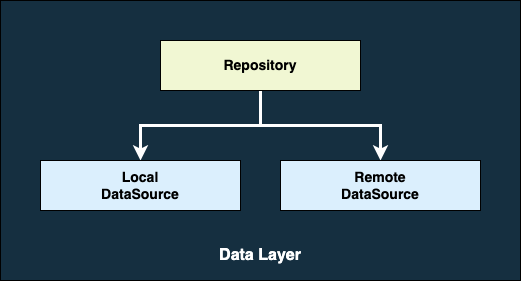
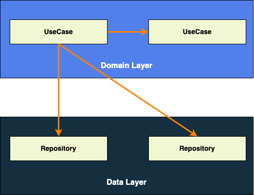

# Android App Architecture

<!-- TOC -->

* [Android App Architecture](#android-app-architecture)
    * [Motivation](#motivation)
    * [App Architecture](#app-architecture)
        * [Sample Application](#sample-application)
        * [Data Layer](#data-layer)
        * [Domain Layer](#domain-layer)
        * [UI Layer](#ui-layer)

<!-- TOC -->

## Motivation

Ideally, we would want to build something very scalable yet very concise, easy to understand, and
simple to implement.

## App Architecture

We are following the App Architecture suggested by Google.

- [Guide to app architecture ](https://developer.android.com/topic/architecture)
- [Architecture - MAD Skills](https://www.youtube.com/playlist?list=PLWz5rJ2EKKc8GZWCbUm3tBXKeqIi3rcVX)

### Sample Application

We have build the sample application to demonstrate the App Architecture.

see the [**Sample application page**](./sample_application.md) for more details about the sample
application.

### Data Layer

The data layer contains application data and business logic. The business logic is what gives value
to our app. It determines how application data must be created, stored, and changed.

To learn more about this layer, see the [**Data layer page**](./data_layer.md).

### Domain Layer

The domain layer is responsible for encapsulating complex business logic, or simple business logic
that is reused by multiple ViewModels.

To learn more about this layer, see the [**Domain layer page**](./domain_layer.md).

### UI Layer

The role of the UI is to display the application data on the screen and also to serve as the primary
point of user interaction.

To learn more about this layer, see the [**UI layer page**](./ui_layer.md).