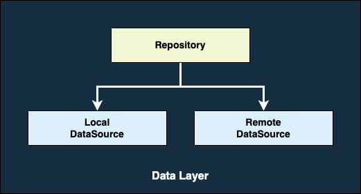

# Data Layer

<!-- TOC -->

* [Data Layer](#data-layer)
    * [Data Layer Architecture](#data-layer-architecture)
        * [Data Source](#data-source)
        * [Repository](#repository)
    * [Naming conventions](#naming-conventions)
    * [Package Structure](#package-structure)
    * [Unit Testing](#unit-testing)
    * [Reference](#reference)

<!-- TOC -->

The data layer contains application data and business logic. The business logic is what gives value
to our app. It determines how application data must be created, stored, and changed.

Repository classes are responsible for the following tasks:

- Exposing data to the rest of the app.
- Centralizing changes to the data.
- Resolving conflicts between multiple data sources.
- Abstracting sources of data from the rest of the app.
- Containing business logic.

## Data Layer Architecture

The data layer is made of repositories that each can interact with 0, 1, or more data sources.



### Data Source

Data sources, much like their name suggests, are responsible for providing data the app needs to
function. They may present data form the network, a local database, files, or even, from memory. And
they should have the responsibility of working only with one source of data.

Remember that all the layers in your app should never depend on data sources directly. The entry
points to the data layer are always their repository classes.

In our sample app we have one datasource `UserRemoteDataSource` - Responsible for providing `User`
data from network.

```kotlin
// UserRemoteDataSource.kt

@Singleton
class UserRemoteDataSource @Inject constructor(
    private val userService: UserService
) : RemoteDataSource {

    suspend fun getUsers(page: Int): List<User> {
        val response = userService.getUsers(page = page)
        val users = response.data.map {
            it.toDataModel()
        }
        return users
    }
}
```

**Exposing Resource**

The data source should have its own model and it should be internal to the data layer and expose a
new model which should be independent of the datasource model. This is demonstrated in the
following snippet:

```kotlin
// UserApiModel.kt

/**
 * Network representation of [User]
 */
data class UserApiModel(
    val id: Long,
    val email: String,
    @SerializedName("first_name")
    val firstName: String,
    @SerializedName("last_name")
    val lastName: String,
    val avatar: String,
)
```

```kotlin
// User.kt

/**
 * External data layer representation of a [User]
 */
data class User(
    val id: Long,
    val email: String,
    val firstName: String,
    val lastName: String,
    val avatar: String,
)
```

The network model can then define an extension method to convert it to the external model

```kotlin
// UserApiModelExtension.kt

/**
 * Converts the remote (API) model to the external (Data) model for use
 * by layers external to the data layer
 */
fun UserApiModel.toDataModel(): User {
    return with(this) {
        val user = User(
            id = id,
            email = email,
            firstName = firstName,
            lastName = lastName,
            avatar = avatar
        )
        user
    }
}
```

### Repository

Repository classes are used by all the layers in our app to interact with the data layer. They are
responsible for exposing data to the rest of the app, but also, for centralizing changes to the
data, resolving conflicts between multiple data sources, and containing business logic.

We should create a repository class for each different type of data we handle in your app. For
example, we might create a `TicketRepository` class for data related to tickets, or
a `ChangeRepository` class for data related to change.

In our sample app we have one repository `UserRepository` - Responsible for providing `User`
data to app.

```kotlin
// UserRepository.kt

interface UserRepository : Repository {

    suspend fun getUsers(page: Int): List<User>
}
```

```kotlin
// BaseUserRepository.kt

@Singleton
class BaseUserRepository @Inject constructor(
    private val userLocalDataSource: UserLocalDataSource,
    private val userRemoteDataSource: UserRemoteDataSource
) : UserRepository {

    override suspend fun clearStore() {
        userLocalDataSource.clearStore()
    }

    override suspend fun getUsers(page: Int): List<User> {
        val users = userRemoteDataSource.getUsers(page = page)
        return users
    }
}
```

## Naming conventions

**Repository** classes are named after the data that they're responsible for. The convention is as
follows:

> type of data + Repository

For example: `NewsRepository`, `MoviesRepository`, or `PaymentsRepository`.

**Data source** classes are named after the data they're responsible for and the source they use.
The
convention is as follows:

> type of data + type of source + DataSource

For the type of data, use Remote or Local to be more generic because implementations can change. For
example: `UserRemoteDataSource` or `UserLocalDataSource`

## Package Structure

```
data/
├─ datasource/
│ ├─ local/
│ │ ├─ entity/
│ │ │ ├─ UserEntity
│ │ ├─ UserLocalDataSource
│ ├─ remote/
│ │ ├─ model/
│ │ │ ├─ UserApiModel
│ │ ├─ UserRemoteDataSource
├─ model/
│ ├─ User
├─ repository/
│ ├─ UserRepository
```

## Unit Testing

In Data layer we should write unit test for,

- Repository class - By mocking its dependency (DataSource)
- Mapper methods.

## Reference

- https://developer.android.com/topic/architecture/data-layer
- https://www.youtube.com/watch?v=r5AseKQh2ZE


