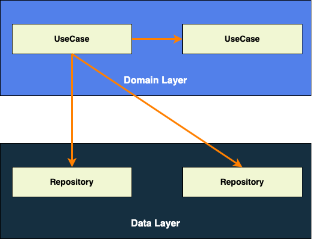

# Domain Layer

<!-- TOC -->

* [Domain Layer](#domain-layer)
    * [Domain Layer Architecture](#domain-layer-architecture)
        * [UseCase](#usecase)
    * [Naming conventions](#naming-conventions)
    * [Package Structure](#package-structure)
    * [Unit Testing](#unit-testing)
    * [Reference](#reference)

<!-- TOC -->

The domain layer sits between the UI layer and the data layer.

The domain layer is responsible for encapsulating complex business logic, or simple business logic
that is reused by multiple ViewModels.

A domain layer provides the following benefits:

- It avoids code duplication.
- It improves readability in classes that use domain layer classes.
- It improves the testability of the app.
- It avoids large classes by allowing you to split responsibilities.

## Domain Layer Architecture

The domain layer is made of UseCases.



### UseCase

UseCase classes should be simple and lightweight, each UseCase should only have responsibility over
a single functionality, and they should not contain mutable data.

UseCase classes can depend on repository classes and other UseCase classes.

**Sharing Threading & ErrorHandling using Base UseCase**

**Threading**

UseCases must be main-safe; in other words, they must be safe to call from the main thread. Hence
UseCase operation should be moved to background thread.

Base UseCase contains this Threading logic in common place, so we don't need to repeat it in each
UseCases.

**Error Handling**

Repository can throw exceptions (like NetworkError etc), since Kotlin doesn't have CheckedException
concept, compiler doesn't mandated us to wrap the throws method with try-catch, therefore using
Repository directly in ViewModel may lead to lot of UnChecked exceptions.

To avoid above issue we use DomainLayer (UseCase) to catch the exception from DataLayer and expose
it as `Result<T>` object which mandates ViewModel to handle both success & error case.

Base UseCase contains this ErrorHandling logic in common place, so we don't need to repeat it in
each UseCases.

```kotlin
// UseCase.kt

/**
 * Executes business logic synchronously or asynchronously using Coroutines.
 */
@Suppress("TooGenericExceptionCaught")
abstract class UseCase<in P, R>(private val coroutineDispatcher: CoroutineDispatcher) {

    /** Executes the use case asynchronously and returns a [Result].
     *
     * @return a [Result].
     *
     * @param parameters the input parameters to run the use case with
     */
    suspend operator fun invoke(parameters: P): Result<R> {
        return try {
            // Moving all use case's executions to the injected dispatcher
            // In production code, this is usually the Default dispatcher (background thread)
            // In tests, this becomes a TestCoroutineDispatcher
            withContext(coroutineDispatcher) {
                execute(parameters).let {
                    Result.Success(it)
                }
            }
        } catch (exp: Exception) {
            when (exp) {
                // Throw Cancellation exception - It will not cause crash - because Coroutine will ignore CancellationException
                is CancellationException -> {
                    throw exp
                }
                else -> {
                    Result.Error(exp)
                }
            }
        }
    }

    /**
     * Override this to set the code to be executed.
     */
    @Throws(RuntimeException::class)
    protected abstract suspend fun execute(parameters: P): R
}
```

In our sample app we have one usecase `GetUserListUseCase` - Responsible for getting `UserList`.

```kotlin
// GetUserListUseCase.kt

class GetUserListUseCase @Inject constructor(
    private val userRepository: UserRepository,
    @IoDispatcher dispatcher: CoroutineDispatcher
) : UseCase<GetUserListUseCase.Param, List<User>>(dispatcher) {

    data class Param(
        val page: Int
    )

    override suspend fun execute(parameters: Param): List<User> {
        val users = userRepository.getUsers(page = parameters.page)
        return users
    }
}
```

**Calling use cases**

We have made usecase class instances callable as functions by defining the invoke() function with
the operator modifier.

In this example, the invoke() method in `GetUserListUseCase` allows us to call instances of the
class as if they were functions.

> `val result = getUserListUseCase(parameters = param)`

## Naming conventions

**UseCases** are named after the single action they're responsible for. The convention is as
follows:

> verb in present tense + noun/what (optional) + UseCase.

For example: `FormatDateUseCase`, `LogOutUserUseCase`, `GetLatestNewsWithAuthorsUseCase`,
or `MakeLoginRequestUseCase`.

## Package Structure

```
domain/
├─ usecase/
│ ├─ GetUserListUseCase
```

## Unit Testing

In Domain layer we should write unit test for,

- UseCase class - By mocking its dependency (Repository, UseCase)

## Reference

- https://developer.android.com/topic/architecture/domain-layer
- https://www.youtube.com/watch?v=gIhjCh3U88I


