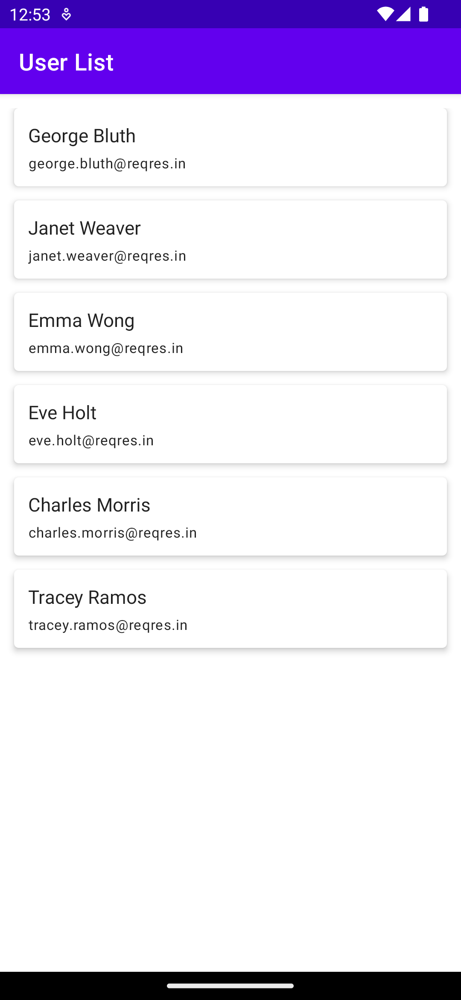

# Sample Application

We have build the sample application to demonstrate the App Architecture.

Sample application - Gets the list of Users from the API and displays it on the screen.



**API**

We will be using [Reqres](https://reqres.in/) to fetch the Users and display it in UI.

https://reqres.in/api/users?page=1

**Response**

```
{
  "page": 1,
  "per_page": 6,
  "total": 12,
  "total_pages": 2,
  "data": [
    {
      "id": 1,
      "email": "george.bluth@reqres.in",
      "first_name": "George",
      "last_name": "Bluth",
      "avatar": "https://reqres.in/img/faces/1-image.jpg"
    },
    {
      "id": 2,
      "email": "janet.weaver@reqres.in",
      "first_name": "Janet",
      "last_name": "Weaver",
      "avatar": "https://reqres.in/img/faces/2-image.jpg"
    }
  ],
  "support": {
    "url": "https://reqres.in/#support-heading",
    "text": "To keep ReqRes free, contributions towards server costs are appreciated!"
  }
}
```