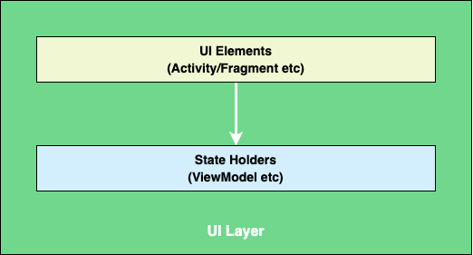

# UI Layer

<!-- TOC -->

* [UI Layer](#ui-layer)
    * [UI Layer Architecture](#ui-layer-architecture)
        * [A basic case study](#a-basic-case-study)
        * [UI State](#ui-state)
        * [UI Event](#ui-event)
        * [Side Effects](#side-effects)
        * [State Holder (ViewModel)](#state-holder--viewmodel-)
        * [UI Element (Activity/Fragment)](#ui-element--activityfragment-)
    * [Naming conventions](#naming-conventions)
    * [Package Structure](#package-structure)
    * [Unit Testing](#unit-testing)
    * [Reference](#reference)

<!-- TOC -->

The role of the UI is to display the application data on the screen and also to serve as the primary
point of user interaction. Whenever the data changes, either due to user interaction (like pressing
a button) or external input (like a network response), the UI should update to reflect those
changes. Effectively, the UI is a visual representation of the application state as retrieved from
the data layer.



UI layer is responsible for the following tasks:

- Consume app data and transform it into data the UI can easily render.
- Consume UI-renderable data and transform it into UI elements for presentation to the user.
- Consume user input events from those assembled UI elements and reflect their effects in the UI
  data as needed.
- Repeat steps 1 through 3 for as long as necessary.

## UI Layer Architecture

The ui layer is made of UI Elements (Activity/Fragments etc) & State Holders (ViewModel etc)


### A basic case study

We will be using our sample application as a case study. The app fetches list of users and displays
it. In summary, the app lets users do the following:

- View list of users.
- Navigate to detail screen on selecting the user.


### UI State

Refer to the case study outlined earlier. In short, the UI shows a list of users. This information
that the app presents to the user is the UI state.

In other words: if the UI is what the user sees, the UI state is what the app says they should see.
Like two sides of the same coin, the UI is the visual representation of the UI state. Any changes to
the UI state are immediately reflected in the UI.


Consider the case study; in order to fulfill the app's requirements, the information required
to fully render the UI can be encapsulated in a `UserListUIState` data class defined as follows:

```kotlin
// UserListUIState.kt

sealed interface UserListUIState {

    object Loading : UserListUIState

    data class Data(
        val users: List<UserUIModel>
    ) : UserListUIState

    object Error : UserListUIState
}

data class UserUIModel(
    val id: Long,
    val name: String,
    val email: String,
    val avatar: String,
)
```

### UI Event

UI events are actions that should be handled in the UI layer, either by the UI or by the ViewModel.
The most common type of events are user events. The user produces user events by interacting with
the app—for example, by tapping the screen or by generating gestures. The UI then consumes these
events using callbacks such as `onClick()` listeners.

The ViewModel is normally responsible for handling the business logic of a particular user event—for
example, the user clicking on a button to refresh some data. Usually, the ViewModel handles this by
exposing functions that the UI can call. User events might also have UI behavior logic that the UI
can handle directly—for example, navigating to a different screen or showing a `Snackbar`.

There are multiple ways to pass the events to the `ViewModel` from `View`

1. Exposing dedicated method for each event.
2. Exposing single method to handle all the events.

In Freshservice we will be going with approach 2 of - Exposing single method to handle all the
events.

Consider the case study; in order to fulfill the app's requirements, all the events that can
originate from View is modeled in single sealed class `UserListEvent`

```kotlin
// UserListEvent.kt

sealed interface UserListEvent {

    data class ItemClicked(
        val user: UserUIModel
    ) : UserListEvent
}
```

### Side Effects

In the real world such a system cannot exist without side effects.

Side effects are commonly truly one-off events like navigation, toasts etc that do not alter the
state of the UI, so we can't model it in `UIState`. SideEffects are separate stream used to
communicate one-off events to View from ViewModel.

Consider the case study; in order to fulfill the app's requirements, all the one-off events
that can originate from ViewModel is modeled in single sealed class `UserListSideEffect`

```kotlin
// UserListSideEffect.kt

sealed interface UserListSideEffect {

    data class NavigateToUserDetailScreen(
        val userID: Long
    ) : UserListSideEffect
}
```

### State Holder (ViewModel)

The classes that are responsible for the production of UI state and contain the necessary logic for
that task are called state holders, typical implementation of state holders is a instance of
ViewModel

The interaction between the UI and its ViewModel class can largely be understood as event input and
its ensuing state output

The pattern where the state flows down and the events flow up is called a unidirectional data flow (
UDF). The implications of this pattern for app architecture are as follows:

- The ViewModel holds and exposes the state to be consumed by the UI. The UI state is application
  data transformed by the ViewModel.
- The UI notifies the ViewModel of user events.
- The ViewModel handles the user actions and updates the state.
- The updated state is fed back to the UI to render.
- The above is repeated for any event that causes a mutation of state.

We have defined the `BaseViewModel` to enforce unidirectional data flow (UDF) principle.

```kotlin
// BaseViewModel.kt

abstract class BaseViewModel<STATE, EVENT, SIDEEFECT> : ViewModel() {

    protected val _uiStateStream by lazy { MutableStateFlow(initialState) }
    protected val _sideEffectStream = Channel<SIDEEFECT>(Channel.BUFFERED)

    val uiStateStream: StateFlow<STATE> by lazy { _uiState }
    val sideEffectStream: Flow<SIDEEFECT> = _sideEffect.receiveAsFlow()

    abstract val initialState: STATE

    abstract fun handleEvent(event: EVENT)
}
```

ViewModel implementation for our case study - `UserListViewModel`

```kotlin
// UserListViewModel.kt

@HiltViewModel
class UserListViewModel @Inject constructor(
    private val getUserListUseCase: GetUserListUseCase,
    private val userUIMapper: UserUIMapper
) : BaseViewModel<UserListUIState, UserListEvent, UserListSideEffect>() {

    // Properties
    override val initialState: UserListUIState
        get() = UserListUIState.Loading

    // Initialization
    init {
        loadUsers()
    }

    private fun loadUsers() {
        viewModelScope.launch {
            val param = GetUserListUseCase.Param(page = 1)
            val result = getUserListUseCase.invoke(parameters = param)
            when (result) {
                is Result.Success -> {
                    loadUsersSuccess(users = result.data)
                }
                is Result.Error -> {
                    loadUsersFailure()
                }
            }
        }
    }

    private suspend fun loadUsersSuccess(users: List<User>) {
        val uiModels = users.map {
            userUIMapper(input = it)
        }
        _uiStateStream.update { UserListUIState.Data(users = uiModels) }
    }

    private fun loadUsersFailure() {
        _uiStateStream.update { UserListUIState.Error }
    }

    // Handle Event
    override fun handleEvent(event: UserListEvent) {
        when (event) {
            is UserListEvent.ItemClicked -> {
                onItemClicked(userUIModel = event.user)
            }
        }
    }

    private fun onItemClicked(userUIModel: UserUIModel) {
        sendSideEffect(
            UserListSideEffect.NavigateToUserDetailScreen(userID = userUIModel.id)
        )
    }
}
```

### UI Element (Activity/Fragment)

UI elements, such as activities and fragments that display data independent of the APIs they used to
do this, such as Views or Jetpack Compose.

- UI elements observe the UIState and populate the UI accordingly.
- Send User Events to the ViewModel.

```kotlin
// UserListFragment.kt

@AndroidEntryPoint
class UserListFragment : BaseComponentFragment() {

    override fun onCreateView(
        inflater: LayoutInflater,
        container: ViewGroup?,
        savedInstanceState: Bundle?
    ): View {
        return ComposeView(requireContext()).apply {
            setViewCompositionStrategy(ViewCompositionStrategy.DisposeOnViewTreeLifecycleDestroyed)
            setContent {
                UserListScreen()
            }
        }
    }

    @Composable
    fun UserListScreen() {
        val viewModel: UserListViewModel = viewModel()

        AndroidAppArchitectureTheme() {
            val state = viewModel.uiStateStream.collectAsState().value
            UserListScreenContent(
                state = state,
                handleEvent = viewModel::handleEvent
            )
        }
    }
}
```

## Naming conventions

**UIState** classes are named based on the functionality of the screen or part of the screen they
describe. The convention is as follows:

> functionality + UIState.

For example, the state of a screen displaying users might be called `UserListUIState`.

**UIEvent** classes are named based on the functionality of the screen or part of the screen they
describe. The convention is as follows:

> functionality + UIEvent.

For example, the event for a screen displaying users might be called `UserListUIEvent`.

**SideEffect** classes are named based on the functionality of the screen or part of the screen they
describe. The convention is as follows:

> functionality + SideEffect.

For example, the side effect for a screen displaying users might be called `UserListSideEffect`.

## Package Structure

```
ui/
├─ userlist/
│ ├─ view/
│ │ ├─ components/
│ │ │ ├─ UserListScreen
│ │ ├─ fragment/
│ │ │ ├─ UserListFragment
│ ├─ viewmodel/
│ │ ├─ mapper/
│ │ │ ├─ UserUIMapper
│ │ ├─ model/
│ │ │ ├─ UserListSideEffect
│ │ │ ├─ UserListUIEvent
│ │ │ ├─ UserListUIModel
│ │ ├─ UserListViewModel
```

## Unit Testing

In UI layer we should write unit test for,

- ViewModel class - By mocking its dependency (UseCase, Mapper etc)
- Mapper Class.
- Helper Class

## Reference

- https://developer.android.com/topic/architecture/ui-layer
- https://www.youtube.com/watch?v=p9VR8KbmzEE
