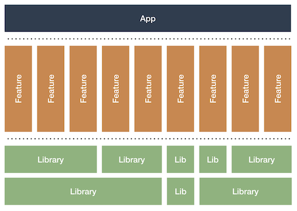

# Modularization

<!-- TOC -->

* [Modularization](#modularization)
    * [Resources](#resources)
    * [Modularization](#modularization)
    * [Modularization - Why you should care](#modularization---why-you-should-care)
    * [Modularized Architecture](#modularized-architecture)
    * [Application Structure](#application-structure)
    * [Navigation](#navigation)

<!-- TOC -->

## Resources

We have implemented Modularization architecture using resource from above links, kindly read through
it for better understanding.

- [Jeroen Mols - Modularization](https://jeroenmols.com/blog/2019/03/06/modularizationwhy)
- [Android Developers - Guide to Android app modularization](https://developer.android.com/topic/modularization)

## Modularization

Modularization is incredibly powerful to speed up our builds, simplify development and fundamentally
scale our team. On top of that, it makes it easier to experiment with new technologies.

## Modularization - Why you should care

Refer -  [**Modularization - Why we should care**](./modularization_why_we_should_care.md)

## Modularized Architecture

Refer -  [**Modularized Architecture**](./modularized_architecture.md)

## Navigation

Refer -  [**Navigation**](./modularization_navigation.md)

## Application Structure

Refer -  [**Application Structure**](./modularization_application_structure.md)

