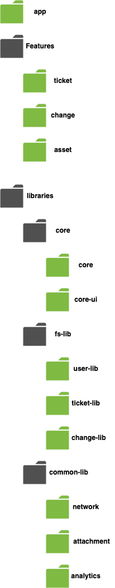

# Application Structure

One of the key benefits of the three-layer app-features-libraries architecture is supposed to be
clear navigation throughout the app and source code.

- There is one `app` that consists out of some features: `ticket`, `change`, and `asset` etc. It is backed
  by a few libraries: `core`, `user-lib`, `network` etc.

- All feature modules are grouped within the features folder.

- All library modules are grouped within the libraries folder, within library folder we have further
  grouped as: `core`, `fs-lib` and `common-lib`.