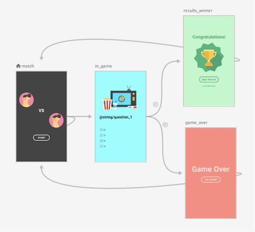
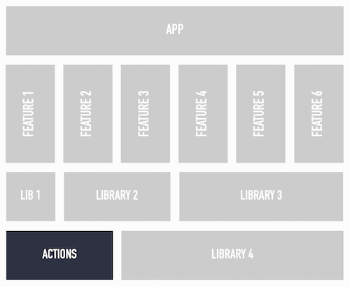
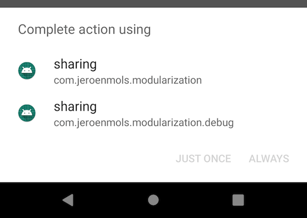

# Navigation

<!-- TOC -->

* [Navigation](#navigation)
    * [Within a feature](#within-a-feature)
    * [Between features](#between-features)

<!-- TOC -->

let’s explore the two different modes of navigation:

- within a feature
- between features

## Within a feature

All navigation within a feature is handled by the navigation components.

Learn more about Navigation Component - [Here](https://developer.android.com/guide/navigation)



## Between features

Recall that features are full screen (entry point is an Activity) and different features aren’t
allowed to rely on each other.

This means that the login feature cannot start the dashboard feature using an explicit Intent (e.g.
by defining the exact class of the Activity to start):

``` kotlin
startActivity(Intent(activity,DashboardActivity::class.java))
``` 

But has to use an implicit Intent instead, where you basically ask for some Activity that can handle
the action.opendashboard:

``` kotlin
startActivity(Intent("action.dashboard.open"))
``` 

Which will start the DashBoardActivity as it defines it will respond to that action in the
manifest.xml of the dashboard feature:

``` kotlin
<manifest xmlns:android="http://schemas.android.com/apk/res/android"
    package="modularization.dashboard">
    <application android:theme="@style/AppTheme" >
        <activity android:name=".DashboardActivity">
            <intent-filter>
                <action android:name="action.dashboard.open"/>
                <category android:name="android.intent.category.DEFAULT" />
            </intent-filter>
        </activity>
    </application>
</manifest>
``` 

However, implicit intents alone don’t fully solve how to navigate between features:

1. Duplication of action String “action.opendashboard” in the feature manifest and every feature
   that wants to create an intent with that action
2. In-depth knowledge required of how to create Intent with extras when passing data into a
   feature (e.g. name of extras)
3. Another app can define the same action causing a chooser dialog to pop up (also possible between
   multiple build flavors)

The first two can be solved by introducing an actions module that is responsible for generating
properly formatted intents to start feature Activities:



``` kotlin
object Actions {
    fun openLoginIntent() = Intent("action.login.open")
    fun openDashboardIntent() = Intent("action.dashboard.open")
    fun openSharingIntent() = Intent("action.sharing.open")
}
``` 

Starting the next feature can then simply be done by:

``` kotlin
activity.startActivity(Actions.openDashboardIntent())
``` 

Not only is this a very descriptive way of linking to the next feature, but this principle can also
be used to make passing data into the new feature type safe:

``` kotlin
object Actions {
    fun openDashboardIntent(userId: String) =
        Intent(context, "action.dashboard.open")
            .putExtra(EXTRA_USER, UserArgs(userId))
}
``` 

Now the login feature no longer needs to know how the data is passed into the dashboard, it simply
has to call:

Finally, relying on implicit Intents can cause chooser dialogs to pop up. While a collision with a
3rd party app is unlikely, it can easily happen for different build flavors.



This can easily be avoided by restricting the intents to the current package:

``` kotlin
object Actions {
    fun openLoginIntent(context: Context) =
        internalIntent(context, "action.login.open")
 
    private fun internalIntent(context: Context, action: String) =
        Intent(action).setPackage(context.packageName)
  }
``` 