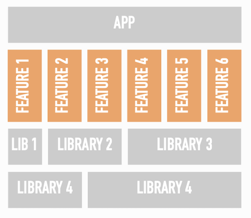
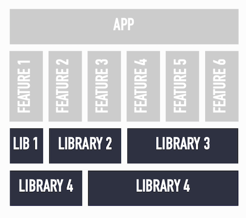
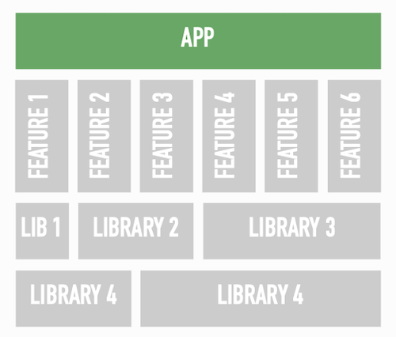

# Modularized Architecture

<!-- TOC -->

* [Modularized Architecture](#modularized-architecture)
    * [Feature Module](#feature-module)
    * [Library modules](#library-modules)
    * [App module](#app-module)
    * [Benefits of Three Layered Architecture](#benefits-of-three-layered-architecture)

<!-- TOC -->

This architecture basically splits an app into three levels of modules:

- **App**: links together features modules (usually only one)
- **Features**: self-contained, full-screen UI level features. Each feature consists of at least one
  activity and optionally a navigation graph. Feature modules never directly depend on each other.
- **Libraries**: functionality shared across multiple features. Different libraries can depend on
  each other

Let’s investigate these three levels in depth.

## Feature Module

Probably the most important modules are feature modules. These have the following characteristics:

- an android-library module
- single activity with (optional) navigation graph (multiple activities are allowed)
- respond to implicit intents and pass back a result
- never depend on other features or app
- depend on several library modules

Feature modules correspond with full screen, coherent user facing functionality in the app: e.g.
user login, app settings, picture cropping,…

## Library modules

Libraries provide shared plumbing that is reused across several or all features. Their
characteristics are:

- android library, pure Java or pure Kotlin module
- never depend on features or app
- can (but don’t have to) depend on other libraries

Consequently, libraries can be very diverse: e.g. UI components, data storage, network
communication, std lib,…

Where features are a “vertical slice” of the app, libraries are a “horizontal slice”, providing
functionality to several other modules.

## App module

Links feature modules together in a useful app

- Android application module
- Depends on other features and libraries
- Orchestrates navigation between features

## Benefits of Three Layered Architecture

This simple, three-layered architecture of app, features and libraries has the the following
benefits:

- Simplifies navigation by splitting the in-feature and across feature navigation
- Makes it easy to find back screens and understand features (especially when using the navigation
  graph)
- Enables scaling teams: fewer merge conflicts between feature teams as features are decoupled
- Makes test automation easier: features can be started directly, no need to step through the app to
  the feature first
- Simplifies experimenting with new technologies: quickly achieve end-to-end benefits within feature
    + Low cost of bad technology choice (isolated from rest of the app)
- Allows staged rollout of rewritten features using feature toggles