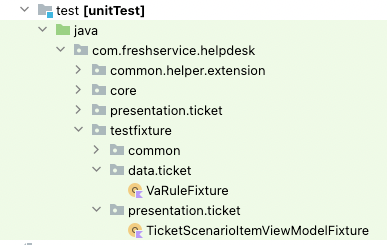

# Object Mother (Test Fixture)

<!-- TOC -->

* [Object Mother (Test Fixture)](#object-mother--test-fixture-)
    * [Problem - Test data duplication](#problem---test-data-duplication)
    * [Object Mother](#object-mother)
    * [Problem - With Object Mother](#problem---with-object-mother)
    * [Easy Random](#easy-random)
    * [Object Mother package sturcture](#object-mother-package-sturcture)
    * [Conclusion](#conclusion)
    * [Reference](#reference)

<!-- TOC -->

## Problem - Test data duplication

The test method usually contains some setup data, some actions, and then some verifications.

The setup data is created as part of the test and the same setup data might be needed in multiple
test cases with slight variation. Usually, we will copy paste the setup data between the tests and
make the slight change that we needed for the test case.

Above approach will make our test code harder to maintain. When things change then you might need to
change test data in numerous locations.

```kotlin
@Test
fun placeOrderWithoutProductShouldError() {
    val customer = Customer("Peter", emptyList())

    assertThrows<IllegalArgumentException> { orderService.placeOrder(customer) }
    verify(orderRepository, never()).save(customer)
}

@Test
fun placeOrderWithOneProductShouldBeOk() {
    val product = Product("AB101", "Product 1", "The first product")
    val order = Order(product, 10)
    val customer = Customer("Peter", listOf(order))

    orderService.placeOrder(customer)
    verify(orderRepository).save(customer)
}

@Test
fun placeOrderWithHighQuantityShouldError() {
    val product = Product("AB101", "Product 1", "The first product")
    val order = Order(product, 10000)
    val customer = Customer("Peter", listOf(order))

    assertThrows<IllegalArgumentException> { orderService.placeOrder(customer) }
    verify(orderRepository, never()).save(customer)
}
```

As you can see in the example above, the methods are very similar. There’s a slight variation in the
test setup code. When a codebase grows for a period of time, code like this becomes often harder to
maintain. And there is a solution to deal with this: let’s meet Object Mothers.

## Object Mother

> [As Martin Fowler describes](https://martinfowler.com/bliki/ObjectMother.html): “An object mother is
> a kind of class used in testing to help create example objects that you use for testing.”. So, an
> Object Mother is test data factory with a slightly more interesting name. A basic example of an
> Object Mother can be seen below:

```kotlin
object CustomerMother {

    fun createValidCustomer(): Customer {
        val product = Product("AB101", "Product 1", "The first product")
        val order = Order(product, 10)
        return Customer("Peter", mutableListOf(order))
    }

    fun createInvalidCustomer(): Customer {
        return Customer("Peter", mutableListOf())
    }
}
```

The only thing the object mothers should be used for is setting an object into a certain state as
indicated by the method name. So, an object mother can put an object into a valid or invalid state.

## Problem - With Object Mother

While this is a great way to get started, managing test data this way still gets a bit tedious.

This is especially true when dealing with classes which have many properties or relationships.

```kotlin
object TicketMother {
    fun createTicket(): Ticket {
        val ticket = Ticket()
        ticket.id = 12345
        ticket.status = 1
        ticket.subject = "Printer is not working"
        ...
        ...
        ...
        ...
        ...
        ticket.workspaceId = 123
        return ticket
    }
}
```

Another downside is that is that using hardcoded values this way might tempt the user of this
ObjectMother to assert on the hardcoded values in the test. This is not what we want, since this
creates unnecessary dependencies between the tests.

For these reasons, we’re going to introduce a helper library, called Easy Random (formerly know as
EnhancedRandom).

## Easy Random

> Easy Random is a library for generating test data. Easy Random creates instances of deeply nested
> classes. While providing a great out of the box experience, it also provides an extensive way of
> customising. And since Easy Random creates values at random, it’s not possible to depend on the
> hardcoded values, which is a great safeguard in protecting yourself from depending on the test
> values.

Using Easy Random is easy:

```kotlin
val easyRandom = EasyRandom()
val customer = easyRandom.nextObject(Customer::class.java)
```

This would generate a new customer with random values. For example, name of the customer would be a
string such as “GfK3MFRmF”. The customers age would be an age in the whole range of Integers. This
means an age of 43898439 could be generated, but so could an age of -123903.

We want to have a bit more control over the generation of data so that it doesn’t conflict with our
validation. We also want to create more realistic data, and make it possible to customise the
generation of data. For example, to limit the number of possible orders created, you can use the
following code:

```kotlin
val parameters = new EasyRandomParameters ()
    .collectionSizeRange(1, 2)
val random = EasyRandom(parameters)
val customer = random.nextObject(Customer::class.java)
```

There are plenty more options possible, check out the
documentation [Easy Random Wiki](https://github.com/j-easy/easy-random/wiki)

## Object Mother package sturcture

All Object Mother's should be grouped under `fixture` package.

 

## Conclusion

Using EasyRandom in combination with ObjectMothers is a great way to improve your testing. When used
consistently in the codebase, it will lower the maintenance on the unit test and will make writing
tests easier and more pleasant.

## Reference

- https://martinfowler.com/bliki/ObjectMother.html
- https://jworks.io/easy-testing-with-objectmothers-and-easyrandom/


